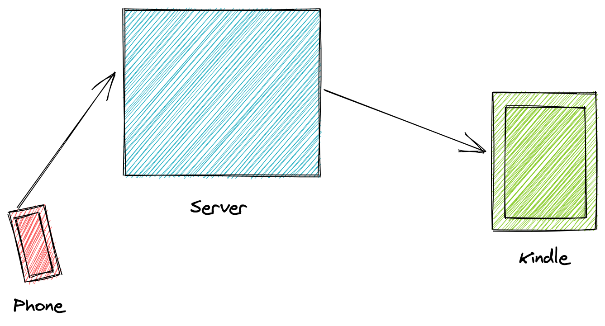

# Hermes


### Details

https://blog.koundinya.xyz/posts/meet-hermes/


###  Flow



###  Components

1. Email - Sendgrid
2. Bot Framework  - telegraf
3. Deployments - Github Actions + Heroku

### Requirements

1. Whitelist an email to receive content on your Kindle. (https://www.amazon.com/gp/sendtokindle/email)

2. Create a send grid account and register a Sender identity (https://app.sendgrid.com/settings/sender_auth)

3. Create a telegram account

#### Environment Variables

1. BOT_TOKEN - Request the Botfather for an API key - https://core.telegram.org/bots#6-botfather

2. EMAIL_DESTINATION - The kindle email that you have whitelisted.

3. EMAIL_SOURCE - The email address registered with send grid.

4. SENDGRID_API_KEY - https://app.sendgrid.com/settings/api_keys


### Running

1. Assuming you have the above mentioned env variables are setup,
run -
```bash
docker-compose up
```
